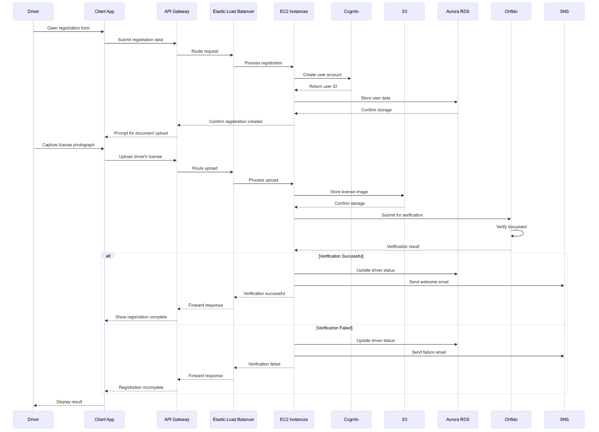
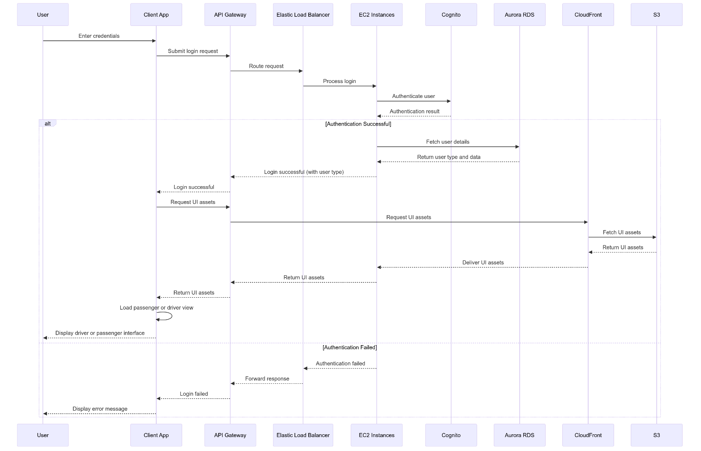

## 1 Introduction

### 1.1 Purpose and Scope

Nüber is a global ridesharing app that connects commuters with drivers,
aimed at making transport as simple and convenient as possible. It
extends traditional ridesharing applications by integrating playlists,
which enable passengers to play their own music during a ride.

### 1.2 System Overview

To accomplish it's purpose, Nüber will require the following services;

a)  a web server to host the application,

b)  an authentication service to handle secure sign-on for drivers and
    passengers,

c)  an email and SMS server to handle account verification and two
    factor authentication,

d)  persistent storage for application assets, driver documents and user
    storage,

e)  caching for fast access to transient storage including commonly
    reused assets,

f)  a mapping API to display directions to drivers, allow passengers to
    choose start/end locations and calculate trip fares,

g)  a crash reporting/telemetry service to aid developers in improving
    Nüber by reporting bugs, crashes and generating analytics to
    understand how Nüber is used,

h)  a payment gateway to handle payment for both drivers and passengers,

i)  API integration with popular music streaming apps to allow
    passengers to choose music,

Additionally, all services will need to be optimised for fast, scalable
global accessibility across peak usage hours, whilst complying with the
legislation of each country.

## 2 Availability Zones

### 2.1 Supported countries

Nüber is planned to have global reach, however due to complexities in
data privacy laws, geopolitical tensions, lack of infrastructure and
economic viability factors many countries will be excluded. Below is a
list of countries Nüber will support, organised by their respective data
privacy laws that must be considered for this architecture:

#### General Data Protection Regulation (GPDR)

-   Austria

-   Belgium

-   Bulgaria

-   Croatia

-   Cyprus

-   Czech Republic

-   Denmark

-   Estonia

-   Finland

-   France

-   Germany

-   Greece

-   Hungary

-   Ireland

-   Italy

-   Latvia

-   Lithuania

-   Luxembourg

-   Malta

-   Netherlands

-   Poland

-   Portugal

-   Romania

-   Slovakia

-   Slovenia

-   Spain

-   Sweden

-   United Kingdom

#### 1988 Privacy Act (Australia)

-   Australia

#### 2020 Privacy Act (New Zealand)

-   New Zealand

#### Personal Information Protection Act

-   South Korea

#### 2023 Digital Personal Data Protection Act

-   India

#### Various/State Specific

-   United States

### 2.2 Shared Principals of Data Laws

#### Informed Consent

Most countries require users to understand how their personal data is
being collected and used.

#### Data rights

Most countries provide individuals with rights regarding their personal
data, including the right to access, correct, and erase their
information.

#### Data collection

Most countries require that personal data be collected for specified,
explicit, and legitimate purposes, with no further processing that may
contradict those purposes.

#### Data Security

Most countries mandate the implementation of appropriate technical and
organisational measures to ensure data security, including protection
against unauthorised or unlawful processing and accidental loss,
destruction, or damage.

#### Data Minimisation:

Most countries incorporate the principle of data minimisation, requiring
that only necessary personal data be collected and processed.

## 2.3 Availability Zones

In order to serve each region efficiently and reliably whilst accounting
for any region-specific data residency legislation, users will be routed
to 'availability zones' across the locations listed below.

### 2.3.1 AWS Locations 

Europe

Frankfurt (eu-central-1)

Ireland (eu-west-1)

Asia Pacific

Seoul (ap-northeast-2)

Mumbai (ap-south-1)

Australia/New Zealand

Sydney (ap-southeast-2)

USA

US East (us-east-1)

US West (us-west-2)

## 3 Core Services

### 3.1 Web Server

**Service:** Amazon EC2 (elastic compute cloud)

Amazon EC2 was chosen as the web server of choice due to its excellent
scalability and load balancing capabilities. An EC2 instance is a
portion of a remote server for-hire, hosted on Amazon's infrastructure.
Numerous EC2 instances can be hired, with each instance providing extra
processing power for the system.

#### Key reasons for decision:

-   EC2 auto-scaling groups enable maximum resource scalability.

-   Amazon Machine Images (AMIs) enable fast deployment of a new EC2
    instance when required.

-   AMIs can be configured per-region to ensure compliance with data
    residency laws.

#### Resource scalability:

As computation power is costly, EC2 can balance fast, reliable service
and costs via 'auto scaling groups' (ASGs). ASGs, abide by a set of
user-defined rules to increase or decrease the amount of EC2 instances
based on the current system load, reported by AWS CloudWatch. This gives
EC2 excellent resource scalability.

#### Geographic scalability:

The load-balanced EC2 architecture inherently provides excellent
geographic scalability. To account for regional time-zones, events,
populations and general ride-sharing demand, the same load-balanced EC2
architecture will be deployed across each availability zone.

#### Security and data residency compliance measures:

-   EC2 instances will be deployed per-region to comply with data
    residency laws.

-   Security groups will be implemented for granular access control to
    prevent unauthorised access.

-   SSL/TLS encryption will be used for data in transit.

-   Regular security audits and vulnerability assessments will be
    conducted to identify potential threat vectors.

-   AMIs will be configured for each region to comply with any potential
    nuances in data residency laws.

#### Implementation:

-   EC2 instances will be deployed across multiple Availability Zones
    (AZs).

-   Auto Scaling Groups (ASGs) will be used in each AZ to automatically
    adjust the number of EC2 instances based on traffic demand to each
    zone.

-   Amazon Machine Images (AMIs) will be used to create additional EC2
    instances on-the-fly.

-   Elastic Load Balancer (ELB) will distribute incoming traffic across
    EC2 instances.

-   Amazon CloudWatch will monitor EC2 instances for performance metrics
    and trigger alarms for resource use, signalling the creation of a
    new EC2 instance.

## 3.2 Authentication/User accounts

**Service:** Amazon Cognito

Amazon Cognito was chosen as the provider of the authentication/user
account provider as it handles authorisation, third-party single-sign-on
integration and access control in a single service.

#### Key reasons behind decision:

-   Cognito enables SSO (single sign-on) through the use of user and
    identity pools, enabling the use of a single identity provider.

-   Cognito supports a wide range of social login services, increasing
    the chance a user can SSO with at least one social login provider.

-   Cognito supports MFA (multi-factor authentication), drastically
    reducing the risk of unauthorised access to user accounts.

#### Resource Scalability:

Amazon Cognito can automatically scale to handle millions of users and
authenticate hundreds of millions of monthly active users, ensuring
proper manage of spikes in user sign-ups or logins.

#### Geographic Scalability:

Cognito supports multi-region deployment, which allows the creation of
user pools in each AZ to handle logins and registrations with low
latency.

#### Security and data residency compliance measures:

-   Users will be presented with a privacy policy and terms of service
    agreement detailing all relevant details regarding how their data is
    collected, stored, and processed, and must consent to this agreement
    prior to creating an account.

-   Cognito\'s built-in GDPR data subject access requests will be
    configured to comply with European data residency laws.

-   Multi-factor authentication (MFA) will be strongly suggested for all
    user accounts to enhance account security.

-   Custom authentication flows will be implemented for age verification
    if required by regional laws.

-   Cognito will integrate with AWS Web Application Firewall for added
    protect against common web exploits.

#### Implementation:

-   Cognito User Pools will manage user sign-up, sign-in, and access
    control for both drivers and passengers.

-   User pools will exist in each availability zone to reduce latency
    and comply with data residency laws.

-   Social identity providers (e.g., Google, Facebook) will be
    configured as identity pools to allow users to sign in with existing
    users accounts.

-   Cognito will use adaptive authentication to detect unusual sign-in
    attempts and prompt for additional verification.

-   Cognito will be configured to automatically expire and rotate user
    tokens for enhanced security.

-   Custom attributes will be added to user profiles to store
    NÜBER-specific information like user type (driver or passenger).

## 3.3 File Upload 

**Service:** Amazon S3 Persistent file storage for Nüber will be handled by Amazon S3, due to its scalability, durability, security considerations, and global accessibility. 

#### Key reasons behind decision:

-   S3 provides encryption in rest and in transit, offering excellent
    file security.

-   S3 uses storage 'buckets' to separate data, and access control can
    be managed for access to each bucket, protecting against
    unauthorised access to sensitive data.

-   S3 offers high durability, ensuring files will remain the same over
    incredibly long periods of time, which is crucial for any critical
    data.

#### Resource Scalability:

S3 provides virtually unlimited storage capacity without need for manual
intervention. S3 can also handle millions of requests per second,
ensuring reliability during high-traffic periods.

#### Geographic Scalability:

Nüber's global reach can be maintained through the use of S3 buckets in
multiple AWS regions where Nüber operates, which both reduces
application latency and ensures compliance with data residency
requirements. Additionally, S3 supports Cross-Region Replication for
critical data, which improves disaster recovery capabilities.

#### Security and data residency compliance measures:

-   S3 Object Lock will be configured to meet GDPR\'s storage limitation
    principle.

-   Separate S3 buckets will be configured for storing PII.

-   CloudWatch alarms will be configured to immediately alert for a
    potential security breach.

-   S3 Access Points will be used for strict fine-grained access control
    to each bucket.

-   S3 Inventory will be used to conduct regular audits of stored PII.

-   All S3 storage buckets will implement encryption both at rest and in
    transit.

-   S3 versioning will be enabled to maintain a history of file changes
    and protect against accidental deletions.

-   S3 access logs will be enabled and stored in a separate bucket for
    security auditing and compliance.

-   Upon account deletion request, all PII will be deleted from relevant
    S3 buckets to comply with the GDPRs right to be forgotten.

-   S3 will implement cross-region replication between primary and
    secondary AZs in the same data residency legislation zones for
    disaster recovery.

#### Implementation:

-   S3 buckets will be created in each availability zone for optimal
    latency.

-   S3 will use multipart uploads for large files to improve upload
    speeds.

<!-- -->

-   Uploaded files will be automatically encrypted at rest using
    S3-managed encryption keys (SSE-S3).

-   S3 lifecycle rules will be implemented to automatically switch S3
    tiers to balance access-speed (S3 Standard) and cost-effectiveness
    (S3 Glacier) based on the age/access frequency of files.

-   S3 bucket policies and IAM roles will be used to enforce strict
    access controls, ensuring only authorised users can access the
    files.

## 3.4 Caching

**Service:** Amazon Elasticache

To ensure the Nüber user experience is as fast and responsive as
possible, a caching solution is necessary for transient data. Caching
places data in random access memory, which offers significantly faster
read-write access than mechanical hard-disks or solid-state-drives. This
translates to fast application response times and reduced database load.

#### Key reasons behind decision:

-   In-memory caching will enable significantly faster access to
    frequently accessed files, improving application response times.

-   Caching reduces database load by keeping data in memory instead of
    continually grabbing the same information.

#### Resource scalability:

ElastiCache stores frequently accessed data in memory, allowing for
sub-millisecond data retrieval, crucial for the time-sensitive nature of
ride sharing. By reducing the load on the primary database, ElastiCache
helps maintain consistent performance even during peak usage periods.

Additionally, ElastiCache is capable of automatically scaling based on
load. It can automatically add or remove cache nodes based on predefined
CPU utilisation thresholds. This ensures that the caching layer can
handle sudden spikes in traffic without manual intervention, while also
optimising costs during periods of low demand.

#### Geographic scalability:

ElastiCache supports Global Datastore for Redis, which enables
multi-region replication. This allows for the deployment of ElastiCache
clusters in multiple AWS regions, with automatic synchronisation between
them. With cache nodes close to users in each geographic location, data
access latency is minimised, ensuring across-the-board responsiveness
for each region.

#### Security and data residency compliance:

-   Data encryption will be used at rest and in transit for all cached
    PII data.

-   Redis AUTH will be configured for access control to prevent
    unauthorised access to cached data.

-   ElastiCache clusters will be deployed per-AZ to ensure data
    localisation of PII.

-   Logs will be used to track access to cached PII for auditing
    purposes.

-   Time to live (TTL) will be used for cached PII data to ensure it is
    not stored longer than needed.

#### Implementation:

-   Elasticache write-through caching for frequently updated information
    such as driver location and ride statuses.

-   Elasticache read-through caching for persistent data like user
    profiles and vehicle information. This means if requested data is
    not in the cache, it is fetched from the database and stored in the
    cache for future requests.

-   Time to Live (TTL) rules will be used for each form of cached data:

-   ElastiCache will store user session data, enabling faster access,
    and reducing database load.

-   Global Datastore for Redis will be configured to handle multi-region
    replication of non-PII cached data.

## 3.5 Database

**Service:** Amazon Aurora with PostgreSQL

Aurora was chosen as the primary database solution for NÜBER due to its
performance, scalability, and compatibility with PostgreSQL

#### Key reasons behind decision:

-   Aurora can provide up to five times the throughput of standard
    PostgreSQL running on the same hardware.

-   Aurora replicas use the same storage medium as the primary instance,
    enabling sub-second updates and reducing failover time.

-   Aurora is better suited for global applications over typical AWS RDS
    setups, making it ideal for Nübers use case.

#### Resource scalability:

Aurora\'s storage can automatically grow in increments of 10GB, up to
64TB. Auto-scaling ensures the database can handle increased volumes of
data with minimal manual intervention. Additionally, Aurora can hold up
to 15 low-latency read replicas, enabling scaling read operations during
peak usage hours.

#### Geographic scalability:

Aurora Global Database enables low-latency global reads and disaster
recovery across AWS Regions, essential for NÜBER\'s global operations to
ensure fast data access across all supported regions.

#### Security and data residency compliance:

-   Encryption will be configured at rest and in transit to protect
    sensitive data or PII.

-   Column-level encryption will be enabled for sensitive fields like
    payment information.

-   AWS Identity and Access Management (IAM) will be configured for
    fine-grained access control.

-   Aurora backup and snapshot features will be configured for disaster
    recovery.

-   Any stored PII will not be replicated to different legislative
    regions to comply with data residency laws.

#### Implementation:

-   The primary Aurora instance for each AZ will handle write operations
    and critical read operations.

-   Read replicas will be deployed across each AZ to handle read-heavy
    operations, improving performance, and reducing load on the primary
    instance.

-   Aurora Global Database will be used to replicate non-PII data across
    regions, to enable low-latency access for users worldwide and for
    it's disaster recovery capabilities.

## 3.6 Analytics and crash reporting

**Service:** Amazon CloudWatch with AWS X-Ray

Amazon CloudWatch and AWS X-Ray were chosen for analytics and crash
reporting due to their comprehensive monitoring, logging, and tracing
capabilities. These services will handle detailed analysis of Nübers
performance, operational health, fail points and user usage patterns.

#### Key reasons behind decision:

-   CloudWatch and X-Ray have excellent compatibility with the
    AWS-dominant architecture of Nüber.

-   CloudWatch displays a unified view of operational health,
    performance metrics, and log data, which simplifies troubleshooting
    and optimisation.

-   X-Ray\'s distributed tracing capabilities allow for end-to-end
    visibility of requests as they travel through each service, enabling
    identification of performance bottlenecks and errors in complex,
    distributed architectures like Nübers.

#### Resource scalability:

CloudWatch automatically scales to handle increasing volumes of metrics
and logs as your application grows. It can ingest, process, and analyse
data from various AWS services and custom sources without manual
scaling.

X-Ray is capable of scaling to complex architectures with thousands of
services, with sampling rates dynamically adjustable to manage the
volume of data as request rates increase, avoiding excessive computing
costs or performance overhead as Nüber\'s traffic grows.

#### Geographic scalability:

CloudWatch and X-Ray can both be deployed per-availability zone,
providing inherent geographic scalability.

#### Security and data residency compliance:

-   CloudWatch Logs will be configured to filter out all relevant PII
    before storage

-   Use X-Ray\'s sampling controls to minimize collection of personal
    data

-   Implement CloudWatch Alarms for real-time monitoring of
    privacy-related metrics

#### Implementation:

-   A CloudWatch and X-Ray instance will be deployed in each
    availability zone.

-   CloudWatch Application Insights will be configured to monitor the
    Nüber application usage patterns.

-   CloudWatch will collect metrics from all AWS services used in the
    Nüber application.

-   CloudWatch Logs will be used to collect error/debug logs from each
    service.

-   CloudWatch Alarms will be set up to alert on critical performance
    thresholds and service disruptions.

-   CloudWatch Dashboards will be created to visualise key performance
    indicators (KPIs) for Nüber.

-   CloudWatch Insights will be used for log querying for
    troubleshooting and analysis.

-   X-Ray will be integrated programmatically to trace and analyse user
    requests across services.

-   X-Ray service maps will be used to visualise service dependencies
    and identify bottlenecks.

## 3.7 Mapping Service

**Service:** Google Maps API

Google Maps API was chosen as the mapping service for Nüber due to its
excellent mapping capabilities, global coverage, and robust feature set.

#### Key reasons behind decision:

-   Google Maps API enables map rendering and efficient geocoding,
    enabling fast, responsive real-time location tracking and route
    calculation.

-   Google Maps API provides inbuilt algorithms for distance calculation
    and ETA predictions, for accurate ride estimations.

-   Google Maps API is highly customisable, allowing custom colour
    schemes and toggles/size adjustment of roads, landmarks, and labels.
    This degree of customisation will allow the map to match Nübers
    application styling, and hide/highlight elements based on
    importance.

#### Resource scalability:

Google Maps API is designed to handle high volumes of requests, enabling
excellent scalability. It uses a quota system that allows for flexible
scaling and accommodation for increased API request volumes.

#### Geographic scalability:

Google Maps provides accurate mapping data worldwide with regular
updates, and supports localisation, offering map views and directions in
local languages.

#### Security and data residency compliance:

-   Google Maps\' Places API will be implemented to enable address
    autocompletion without storing full addresses.

-   Google Maps\' Distance Matrix API will be used for route calculation
    without storing precise routes.

-   Google Maps\' Geocoding API will be configured for region biasing to
    comply with data localisation.

#### Implementation:

-   Google Maps Directions API will be used for route calculation and
    ETA estimation.

-   Google Maps Geocoding API will be used for converting addresses to
    coordinates.

-   Google Maps JavaScript API will be used for rendering interactive
    maps in the NÜBER mobile app.

-   Google Maps Distance Matrix API will be used to calculate distances
    and travel times between points.

-   Google Maps Places API will be used for location autocomplete and
    place details.

-   Maps will be customised using the Google Maps Styling feature to
    match Nüber's branding and styling.

-   Google Maps Roads API will be to link GPS coordinates to roads for
    more accurate driver tracking.

## 3.8 Payment Gateway

**Service:** Stripe

Stripe was chosen as Nüber\'s payment gateway due toitss global reach,
robust security features and high degree of customisation compared to
competitors.

#### Key reasons behind decision:

-   Stripe offers low-latency payment processing and supports
    asynchronous operations, which allows for transactions to occur
    without blocking other app functions.

-   Stripe supports all countries Nüber will be launching in.

-   Stripe has a robust software development kit (SDK) enabling seamless
    integration into Nüber client apps.

#### Resource scalability:

Stripe\'s infrastructure automatically scales to handle transaction
volume fluctuations.

#### Geographic scalability:

Stripe supports over 135 currencies and numerous local payment methods,
enabling global scalability. Stripe is also able to handle currency
conversion and adheres to regional financial regulations, facilitating
expansion into new markets.

#### Security and data residency compliance:

-   Stripes built-in PCI DSS compliance features will be utilised for
    data residency compliance.

-   Stripe\'s data migration tools will be used if needed for improved
    data portability.

-   All data exchanged between Nüber and Stripe will use SSL/TLS
    encryption.

-   Strong Customer Authentication (SCA) will be implemented for
    European transactions to comply with PSD2.

-   Stripe Radar will be used for fraud detection and prevention.

-   Stripe Elements will be integrated into the NÜBER app for secure
    payments.

#### Implementation:

-   Stripe Connect will be used to handle payouts and tax reporting for
    drivers.

-   Nüber will use webhooks to handle asynchronous payment events like
    charges or disputes.

-   Automatic retries will be used for failed payments.

-   Stripe Connect will be configured for region-specific payment
    processing.

-   Stripes SDK will be utilised for seamless payment integration into
    the Nüber client application.

## 3.9 Communication

**Service:** Amazon Simple Notification Service (SNS)

Amazon SNS is a pub/sub messaging system able to handle
application-to-application (A2A) and application-to-person (A2P)
communication.

#### Key reasons behind decision:

-   SNS has excellent compatibility with other AWS hosted services.

-   SNS enables communication between drivers and passengers without
    revealing sensitive information such as phone numbers. SNS offers
    near-real-time message delivery, and supports a wide range of
    protocols including HTTP/S, email, SMS, and in-app push
    notifications.

#### Security and data residency compliance:

-   Server-side-encryption will be configured for messages at-rest and
    in transit.

-   SNS will use IAM roles and policies to control access to publishing
    messages.

-   Any PII stored in a message will not be stored in any way on Nübers
    architecture, and will be obfuscated in logs.

#### Implementation:

-   SNS will be used for sending push notifications to mobile devices.

-   SNS topics will be created for different types of notifications
    (e.g., ride updates, promotions).

-   SNS will integrate with Firebase Cloud Messaging (FCM) for Android
    notifications and Apple Push Notification service (APNs) for iOS.

-   SNS will be used to send SMS messages for time-sensitive
    communications like driver arrival notifications.

-   Email notifications will be sent through Amazon SES integrated with
    SNS.

-   SNS will implement message filtering to ensure users receive only
    relevant notifications.

-   Delivery status tracking will be enabled to monitor and retry failed
    message deliveries.

-   SNS message attributes will be used to include metadata with each
    notification for better tracking and analytics.

-   SNS will be configured to receive and distribute instant
    notifications to staff members from CloudWatch alarms for critical
    system events.

## 3.10 Music Integration

**Service:** Spotify API

Spotify was chosen as the music integration service of choice due to its
dominant market share as well as its excellent API functionality and
security considerations.

#### Key reasons behind decision:

-   Spotify has a dominant 31.7% market share at the time of this
    report, meaning users are most likely to have a Spotify account over
    competitors.

-   Spotify has excellent API functionality, with endpoints to perfectly
    fit Nübers use case.

-   Spotify uses OAuth2 for authentication, and informs users of the
    information being shared with a third party application, making it
    secure and compliant with data-residency laws.

#### Security and data residency compliance:

-   Spotify's inbuilt OAuth2 authentication, will enable users to sign
    in to Spotify without exposing their account details to Nüber.

-   No user data aside from the temporary ride playlist will be shared
    with Nüber, or stored on Nübers architecture.

#### Implementation:

-   Spotify\'s OAuth 2.0 authentication will be used for Nüber user
    authorisation.

-   The Spotify Web API will be used to fetch user playlists and track
    information.

-   Spotify\'s Web Playback SDK will be used to enable Nüber in-app
    playback controls.

-   A temporary \"Nüber Ride\" playlist will be created for each trip.

-   The Create Playlist endpoint will be used to generate the temporary
    ride playlist.

-   The Add Items to Playlist endpoint will be used to add songs to the
    ride playlist.

-   The Get User\'s Playlists endpoint will be used to grab the
    passenger\'s existing playlists.

-   The Delete Playlist endpoint will be called to remove the temporary
    playlist after the ride ends.

## 3.11 Driver's License and Identity Verification

**Services:** Onfido

To ensure the safety and legality of Nübers driver operations, an
identity and driver\'s license verification, Onfido was chosen for
drivers license and identity verification.

#### Key reasons for decision:

-   Onfido has global coverage, supporting license verification for all
    regions Nüber is deployed to.

-   Onfido is SOC2 compliant, meaning user data is securely managed,
    which avoids privacy/data residency infringements

#### Geographic scalability:

Onfido supports document verification from 195+ countries, providing
plenty of room to scale to additional countries in the future.

Security and data residency compliance

-   All transmissions of PII (photographs, licenses) to and from Onfido
    and storage mediums will be encrypted (HTTPS).

-   Strict access controls will be implemented for S3 and RDS to prevent
    unauthorised access to PII.

-   Data minimisation practices will be implemented to ensure no
    unnecessary temporary images are stored after verification.

#### Implementation:

-   Onfido\'s API will communicate with Nüber's backend services.

-   Onfido\'s SDK will be implemented in the Nüber mobile application
    for seamless verification.

-   Users will capture images of their ID/driver\'s license along with a
    photograph of their face via the Nüber app.

-   Verification requests are sent to Onfido\'s API.

-   Results are processed and verification status is stored in RDS.

## 3.12 Content Delivery Network

**Service:** Amazon CloudFront / Amazon Route 53

Amazon CloudFront along with Amazon Route 53 were chosen as the Content
Delivery Network (CDN) and DNS services for Nüber to enable fast,
region-specific content delivery of application assets.

#### Key reasons for decision:

-   CloudFront enables low-latency retrieval of application assets.

-   CloudFront provides added protection against DDoS attacks and
    integrates with AWS Shield and AWS WAF.

-   Route 53 enables geolocation routing to point to specific
    availability zones based on location, enabling legal compliance as
    well as improved application latency.

#### Resource scalability:

CloudFront and Route53 are both capable of automatically scaling to
increased requests without manual intervention.

#### Geographic scalability:

CloudFront uses a global network of edge locations to cache and serve
application assets from servers closest to the users with minimal
latency, giving it excellent geographic scalability.

Route 53 is a core service in Nübers global scalability through
location-based DNS resolution to the fastest/most appropriate AZ for
each user.

#### Security and data residency compliance:

-   CloudFront will not serve any PII data.

-   All content delivery will have SSL/TLS encryption in transit.

-   Route 53 will be used to enforce nuances in data residency laws by
    configuring geolocation routing to an AZ that meets data residency
    legislations for the location of the user.

#### Implementation:

-   CloudFront distribution will be used for Nüber\'s application assets
    not stored within the client application.

-   Origin servers will be used (S3 buckets) for static and dynamic
    content.

-   CloudFront will work with Route 53 to determine the best location to
    serve content from.

## 3.13 API Gateway

**Service:** Amazon API Gateway

Amazon API Gateway was chosen as the API management solution for Nüber
to provide a secure interface between the mobile application and the
backend services.

#### Key points behind decision:

-   API Gateway provides an extra layer of protection against DDoS
    attacks and enables access control to backend functionality.

-   API Gateway has caching capabilities to improve response times and
    reduce load on backend services.

-   API Gateway can integrate with CloudWatch for logging and monitoring
    of API calls.

#### Resource scalability:

API Gateway can automatically scale to the rate of requests
automatically without any manual intervention, ensuring proper handling
of traffic spikes without performance degradation.

#### Geographic scalability:

API Gateway is a globally distributed service, and can be deployed in
each AZ.

#### Security and data residency compliance:

-   API Gateway\'s request validation feature will be implemented to
    ensure only correctly formatted data reaches backend services.

-   API Gateway\'s resource policies will be used for granular access
    control to backend functionality.

-   API Gateway will integrate with WAF for protection against common
    web exploits.

-   CloudWatch will be configured to log API calls for auditing and
    compliance purposes.

#### Implementation:

-   Regional API Endpoints will be deployed to service each AZ to reduce
    connection overhead.

-   API Gateway will serve as the entry point for all Nüber application
    requests, and application logic will correspond to certain endpoints
    (e.g., /users, /rides, /payments, /verify).

-   API authentication and authorisation will be handled by API
    Gateway\'s inbuilt integration with Cognito.

-   CloudWatch alarms will be used to monitor API performance and usage.

## 4 Security Services

### 4.1 Firewall

**Service:** AWS WAF (Web Application Firewall)

#### Implementation:

-   AWS WAF will be deployed in front of API Gateway and CloudFront
    distributions to protect backend services from common web exploits.

### 4.2 DDoS Protection:

**Service:** AWS Shield

#### Implementation:

-   AWS Shield Standard will be used initially

-   AWS Shield Advanced can be an upgrade as the service scales.

### 4.3 Threat Detection:

**Service:** Amazon GuardDuty

#### Implementation:

-   GuardDuty will serve as the main form of threat detection for Nüber.

-   GuardDuty will be enabled in all operational regions.

-   GuardDuty will be integrated with CloudWatch and to trigger malware
    detection alarms.

### 4.4 Management:

**Service:** AWS Key Management Service (KMS)

#### Implementation:

-   AWS KMS will manage cryptographic keys for all services that require
    it.

## 5 System design diagram

### 5.1 Driver registration sequence
<figure>

<figcaption>
Figure 1: Driver registration process
</figcaption>
</figure>

### 5.2 Passenger registration sequence
<figure>

<figcaption>
Figure 2: Passenger registration process
</figcaption>
</figure>

### 5.3 Login process
<figure>
  
<figcaption>
Figure 3: Sequence showing the login process directing a user to the
correct interface (driver or passenger account)
</figcaption>
</figure>

### 5.4 Ride request sequence
<figure>
  
<figcaption>
Figure 4: Ride request sequence from the perspectives of the driver and
passenger

</figcaption>
</figure>

### 5.5 High server demand sequence
<figure>

<figcaption>
Figure 5: High server loads are detected due to increased
demand in a region
</figcaption>
</figure>

### 5.6 Availability zone routing sequence
<figure>

<figcaption>
Figure 6: Directing a user to the correct AZ based on
location
</figcaption>
</figure>

### 5.7 Security sequence for common exploits (DDoS, threat detection)
<figure>

<figcaption>
Figure 7: Example scenario for common web attacks.
</figcaption>
</figure>

### 5.8 System architecture

<figure>

<figcaption>
Figure 7: System architecture showing the separation
between subnets and the services that traverse them
</figcaption>
</figure>

## 6 Extensibility

Nübers architecture was designed with extensibility in mind, with most
of the necessary infrastructure required to extend to food delivery and
courier applications considered in the current design.

### 6.1 Single identity provider

A single identity provider (IdP) allows users to access multiple
services or applications using a single set of credentials. Through use
of Cognito, Nüber could serve as the IdP for ride-sharing, food
delivery, and courier services.

### 6.2 Food delivery and courier services

Nüber could extend to include food delivery without a major overhaul to
the existing architecture. As ridesharing shares many similarities with
food delivery and courier services, the backend of the application would
remain relatively unchanged.

### 6.3 Potential modifications

**Database**

A restaurant database would need to be implemented to accommodate
restaurant profiles and menus, while the backend would require new order
management capabilities.

**Secondary client application**

The Nüber mobile app would need to be either extended or a secondary
application would need to be developed to include food ordering and
tracking features. The driver view would need adaptation to handle food
pickups and deliveries, as well as potential integration with restaurant
point-of-sale systems, or a restaurant specific application.

## 7 Conclusion

The Nuber system architecture presented in this document proposes a
global solution for a ride-sharing application, capable of securely
handling high traffic volumes, ensuring data privacy compliance across
multiple regions, and providing a seamless, responsive user experience.
The system\'s modular design allows for future expansions into food
delivery and courier services, enabling excellent growth potential and
extensibility in the evolving transportation and logistics market.

## 8 Glossary

API: Application Programming Interface

ASG: Auto Scaling Group

AWS: Amazon Web Services

AZ: Availability Zone

CDN: Content Delivery Network

DDoS: Distributed Denial of Service

DNS: Domain Name System

EC2: Elastic Compute Cloud

ELB: Elastic Load Balancer

ETA: Estimated Time of Arrival

FCM: Firebase Cloud Messaging

GDPR: General Data Protection Regulation

HTTPS: Hypertext Transfer Protocol Secure

IAM: Identity and Access Management

KMS: Key Management Service

MFA: Multi-Factor Authentication

OAuth: Open Authorization

PCI DSS: Payment Card Industry Data Security Standard

PII: Personally Identifiable Information

PSD2: Payment Services Directive 2

RDS: Relational Database Service

S3: Simple Storage Service

SCA: Strong Customer Authentication

SDK: Software Development Kit

SES: Simple Email Service

SMS: Short Message Service

SNS: Simple Notification Service

SOC2: Service Organization Control 2

SQL: Structured Query Language

SSL: Secure Sockets Layer

SSO: Single Sign-On

TLS: Transport Layer Security

TTL: Time to Live

WAF: Web Application Firewall

## 9 References

Amazon Web Services n.d., AWS Documentation, viewed 12 September 2024,
https://docs.aws.amazon.com.

Apple Inc. n.d., Apple Push Notification service (APNs), Apple Developer
Documentation, viewed 12 September 2024,
https://developer.apple.com/documentation/usernotifications

Australian Government 1988, Privacy Act 1988, Federal Register of
Legislation, viewed 12 September 2024,
https://www.legislation.gov.au/Details/C2021C00452

Cloudflare n.d., What is a DDoS Attack?, viewed 12 September 2024,
https://www.cloudflare.com/learning/ddos/what-is-a-ddos-attack

European Commission 2015, Payment Services Directive 2 (PSD2), Official
Journal of the European Union, viewed 12 September 2024,
https://eur-lex.europa.eu/legal-content/EN/TXT/?uri=CELEX%3A32015L2366

European Union 2016, General Data Protection Regulation (GDPR), Official
Journal of the European Union, viewed 12 September 2024,
https://eur-lex.europa.eu/legal-content/EN/TXT/?uri=CELEX%3A32016R0679

Google n.d., Firebase Cloud Messaging, viewed 12 September 2024,
https://firebase.google.com/docs/cloud-messaging

Google n.d., Google Maps Platform Documentation, viewed 12 September
2024, https://developers.google.com/maps/documentation

Government of India 2023, Digital Personal Data Protection Act, 2023,
Ministry of Electronics and Information Technology, viewed 12 September
2024,
https://www.meity.gov.in/content/digital-personal-data-protection-act-2023

Internet Engineering Task Force (IETF) 2018, The Transport Layer
Security (TLS) Protocol Version 1.3, RFC 8446, viewed 12 September 2024,
https://datatracker.ietf.org/doc/html/rfc8446

Korea Legislation Research Institute 2011, Personal Information
Protection Act, Korea Law Translation Center, viewed 12 September 2024,
https://elaw.klri.re.kr/eng_service/lawView.do?hseq=53044&lang=ENG

New Zealand Government 2020, Privacy Act 2020, New Zealand Legislation,
viewed 12 September 2024,
https://www.legislation.govt.nz/act/public/2020/0031/latest/LMS23223.html

OAuth n.d., OAuth 2.0, viewed 12 September 2024,
https://oauth.net/2/

Onfido n.d., Onfido Documentation, viewed 12 September 2024,
https://documentation.onfido.com/

PCI Security Standards Council 2022, Payment Card Industry Data Security
Standard (PCI DSS), viewed 12 September 2024,
https://www.pcisecuritystandards.org/document_library/

Spotify n.d., Spotify for Developers, viewed 12 September 2024,
https://developer.spotify.com/documentation/

Stripe n.d., Stripe Documentation, viewed 12 September 2024,
https://stripe.com/docs/
